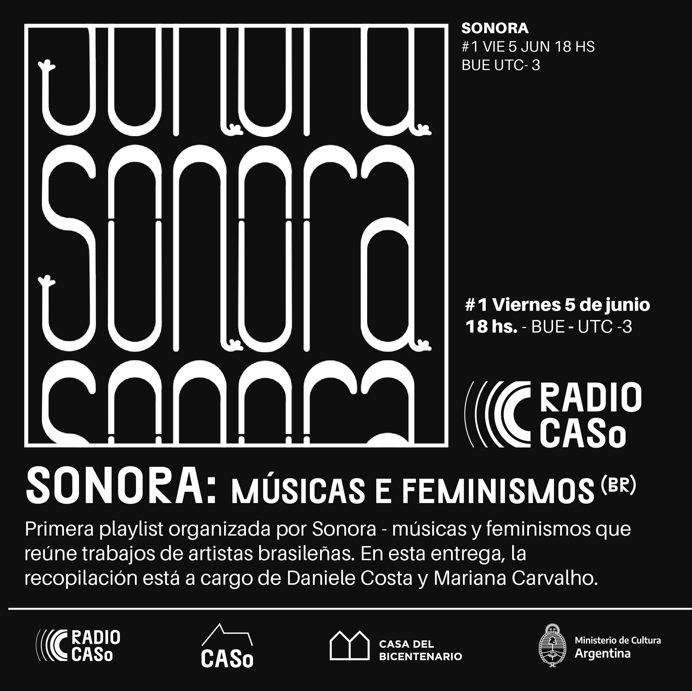

# mono

- Código da música criada pelo programa Sonic Pi

---

- Desenvolvida para [Sonora](http://www.sonora.me/): músicas e feminismos é uma rede colaborativa que reúne artistas e pesquisadorxs interessadxs em manifestações feministas no contexto das artes. Surgiu em abril de 2015 com a necessidade de visibilizar e possibilitar o diálogo sobre o trabalho artístico das mulheres. Sonora propõe a criação e ocupação de espaços, a realização de pesquisas e debates, e está envolvida em atividades musicais e sonoras de diferentes vertentes. Sonora é atravessada por incertezas, indefinições, reticências, aberturas, afetividades, sensibilidades, ruídos.

---

- Fez parte da playlist da [Rádio Caso](https://centrodeartesonoro.cultura.gob.ar/info/radio-caso/)

